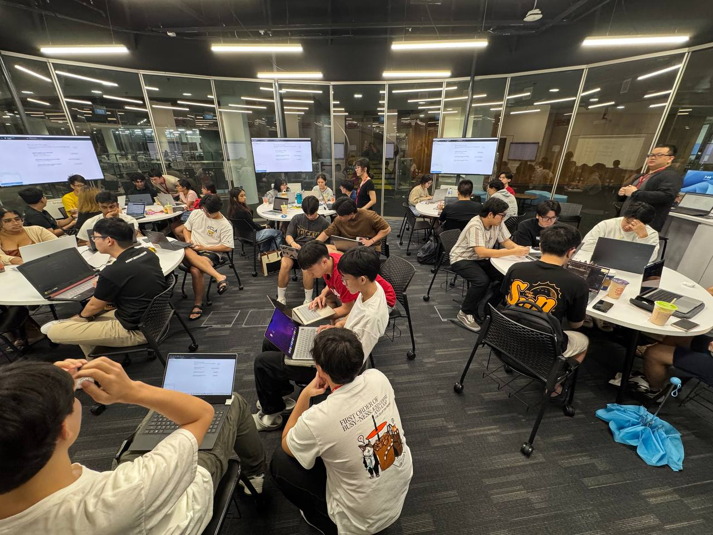
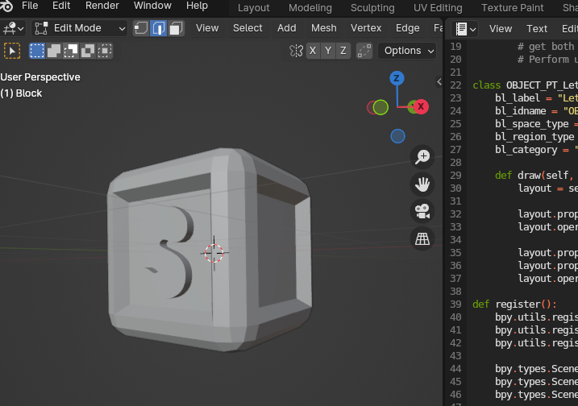

# XR Experience Team Update - March/2025

## Overview
(Update Video)[youtube.com]

### Events & Workshops
#### Intro to Github (19th March 2025)
  
[Link to Workshop Repo](https://github.com/Wooniety/Github-Workshop)
In collaboration with Microsoft Student Ambassadors, this workshop covered:  
- Commits
- Branching
- Merging
- Pull Requests
A total of 60 participants attended, gaining hands-on experience with GitHub Desktop for version control and project collaboration.  

### Development Progress
The team is actively preparing for upcoming game jams and hackathons by developing skillsets:

#### Github Actions
Exploring automated documentation hosting and continuous integration/testing.

####  Blender & Asset Creation
- Learning DCC tools (Blender) for the game asset pipeline.
- Studying Real-Time Rendering to understand the graphics pipeline.
- Experimenting with Blender’s Geometry Nodes for procedural content creation.

## Upcoming Plans
- Participate in game jams during the summer break (May–Aug).
- Begin learning HLSL for shaders and real-time graphics programming.
