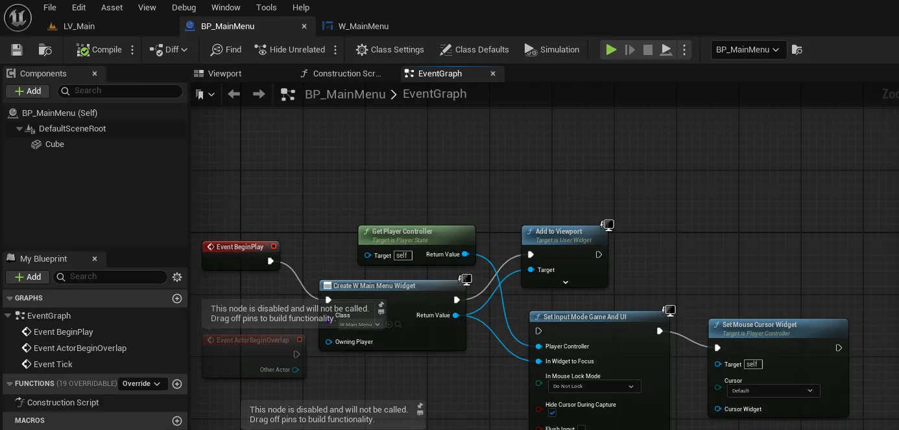
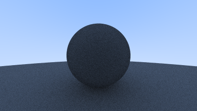
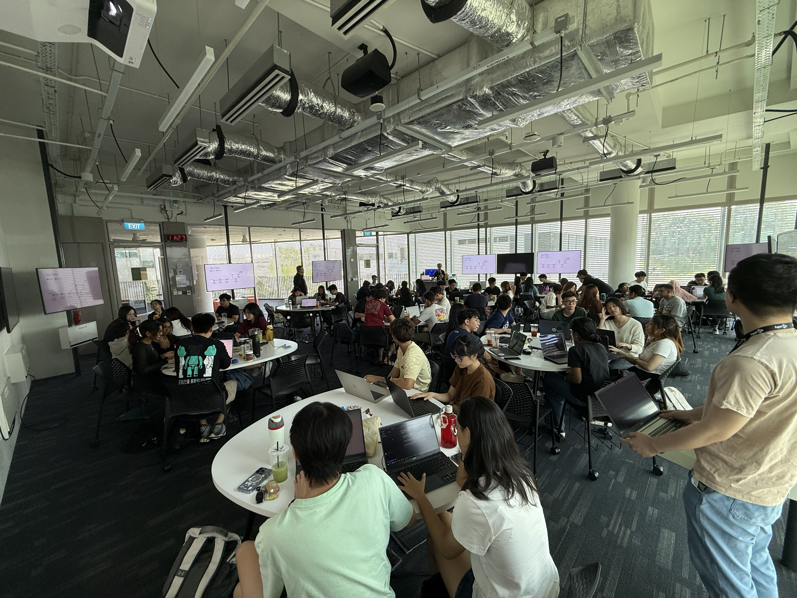

# XR Experience Team Update - May/2025

[Update Video](https://youtu.be/eu4sOoChrqM)

## Hackathons/Game Jams

Participating in Hackathons/Game Jams with mixed teams of existing team members of XR Experience and other NTU students potentially interested in joining the team

### Ongoing

- [SummerBuild 2025](https://build.ilabccds.com/)
    - 📅 26th May - 26th June
    - Developing a game using Unreal Engine as a training opportunity for existing and prospective team members.

### Skill Development

Given that SummerBuild is still ongoing, this is an early snapshot of the skills being explored. A fuller picture will emerge in the next update after the hackathon concludes.

- **Unreal Engine 5**
    - Team members are learning how to use the game development engine UE5
        
        
        
- Visual Assets
    - All visual assets (2D/3D assets, shaders etc) to be created by the team.
- Computer Graphics
    - One team member is exploring writing a simple CPU ray tracer
        
        
        

### Upcoming

- [Pirate Software Game Jam 17](https://itch.io/jam/pirate)
    - 📅 July 17th - July 31st
- [GMTK Game Jam 2025](https://itch.io/jam/gmtk-2025)
    - 📅 July 31st - Aug 4th
    - Globally popular game jam with over 7000 teams in 2024.

## Events & Workshops

### Intro to Github

📅 27 May 2025

60 participants

[Link to Workshop Repo](https://github.com/Wooniety/Github-Workshop)

As part of the iLabs SummerBuild Workshop Series, we re-ran the “Intro to GitHub” workshop in collaboration with the Microsoft Student Ambassadors. This session was designed to equip participants with essential version control skills to support their projects for **SummerBuild 2025**. The workshop covered:

- Commits
- Branching
- Merging
- Pull Requests

Participants gained hands-on experience using GitHub Desktop for collaboration and source control within their hackathon teams.

