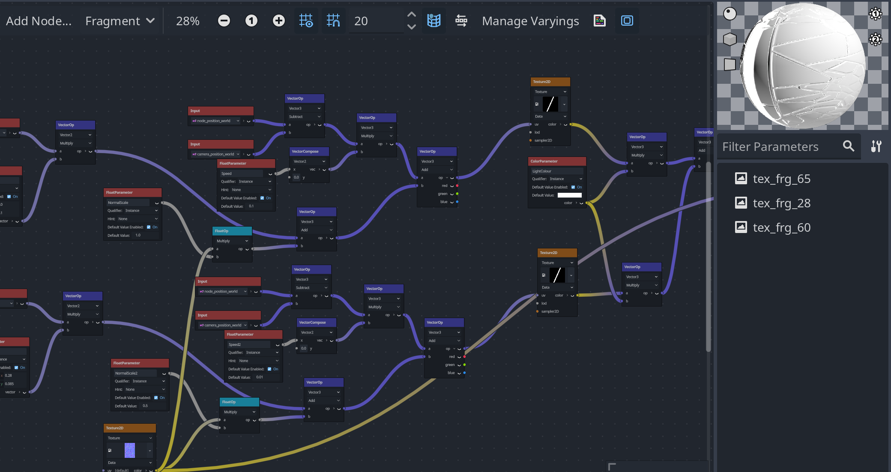
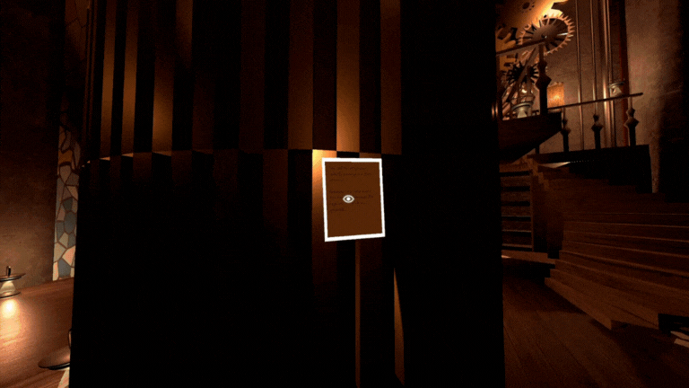
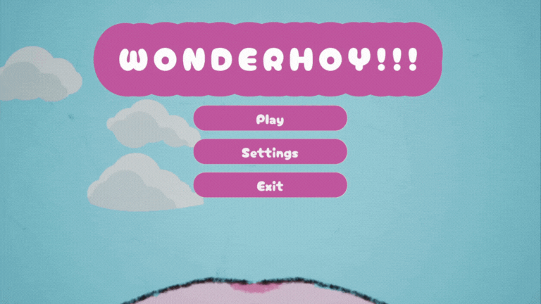
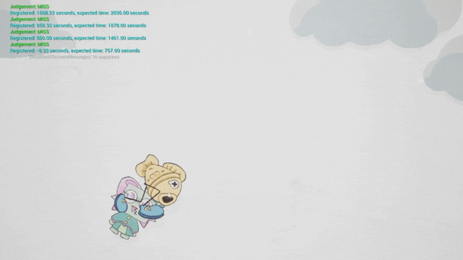

# XR Experience Team Update - July/2025
[Update Video](https://youtu.be/7dFd3HVEN4M)

# Hackathons/Game Jams

 Participated in Hackathons/Game Jams with mixed teams of existing team members of XR Experience and other NTU students potentially interested in joining the team.

Took part in Summerbuild 2025 and Beginner’s Summer Game Jam

## Beginner’s Summer Game Jam

🏆 **Ranked #5 in Visuals and Sound**

 Game jam page link: [https://itch.io/jam/beginners-jam-summer-2025](https://itch.io/jam/beginners-jam-summer-2025) Targeted towards individuals not working in the games industry

Submitted: [The Clock Keeper’s Toll](https://baton-0.itch.io/the-clockkeepers-toll) (100+ teams)

Worked with other students to create a game for the week long game jam to create a first person puzzle exploratation game.

### Skill Development:

- Godot Engine
    - Game was developed in the Godot game engine using GDScript
- Additional 2D assets (Sprites and UI)
- Material Shader Development in Godot
    - Using a mix of GLSL and Godot’s Visual Shaders for various materials used for 3D objects in the game
    
    
    
    
    

## Summerbuild

Hackathon page link: [https://summerbuild-2025.devpost.com/](https://summerbuild-2025.devpost.com/)

Submitted: [WONDERHOY!!!](https://devpost.com/software/wonderhoy)

Work with other students to learn how to use a game engine and developed a rhythm game for summer build

### Skill Development

- Unreal Engine
    - Game was developed in the Unreal Engine using C++
- Additional 2D assets

