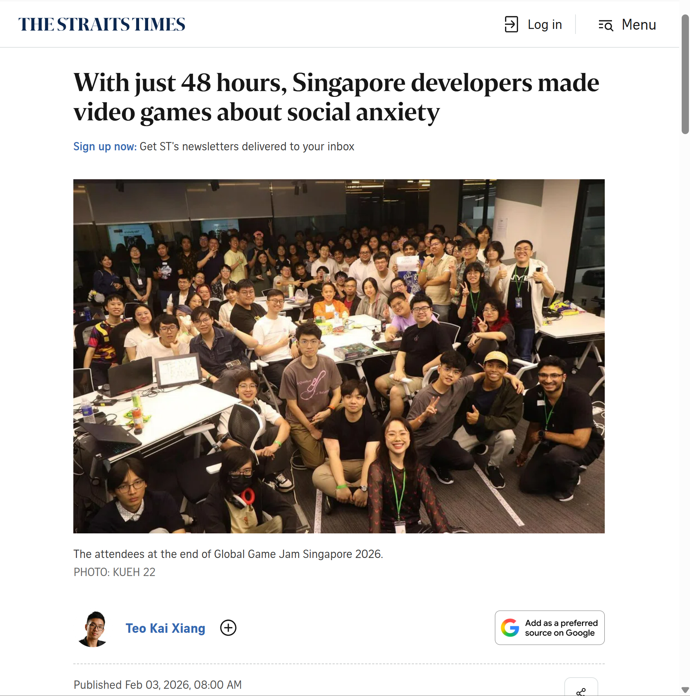

# XR Experience Team Update - March/2026

A competition team in the ilab to take part in game jams (hackathons but for games)

Video link: [https://youtu.be/TgTe0CFFvMY](https://youtu.be/TgTe0CFFvMY)

# Hackathons/Game Jams

 Participated in Hackathons/Game Jams with mixed teams of existing team members of XR Experience and other participants from public game jams.

## Global Game Jam 2026

🗞️ Featured in the [Straits Times](https://www.straitstimes.com/life/with-just-48-hours-singapore-game-developers-made-social-anxiety-in-video-game-form) for Creativity and Humour

 Game jam page link: [Global Game Jam 2026](https://globalgamejam.org/) Targeted towards individuals not working in the games industry

Submitted: [i need more friends in my stupid baka life](https://plasmak.itch.io/i-need-more-friends) (itch.io game page), [Global Game Jam 2026 Submission Page](https://globalgamejam.org/games/2026/i-need-more-friends-my-stupid-baka-life-8)

Worked with a new team of participants for Global Game Jam to develope a game about social anxiety in under 48 hours

### Skill Development:

- Unity Game Engine
    - Game was developed in Unity
- 2D Assets
    - Sprites were drawn in a pixel art style
- Shader Development and Art tooling

# Skill Development

## Shaders

Continued working on authoring fragment/vertex shaders using HLSL in Unity’s URP Pipeline.

3 phases of the galaxy material shader

## 3D Modelling

Collaborated with a member of the Innovation Lab to design a stylised hardware case for their product

Draft model

Test Print

# Upcoming Plans

## GMTK 2026 Game Jam (Around End July/Early Aug)

Game jame site: [https://itch.io/jam/gmtk-jam-2026](https://itch.io/jam/gmtk-jam-2026)

Plans to go for GMTK 2026, a yearly game jame with over 9000 games submitted in 2025.

The youtube videos covering winning games consistently get around a 1 Million views

