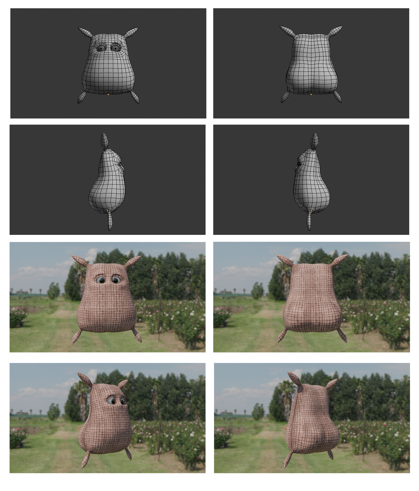
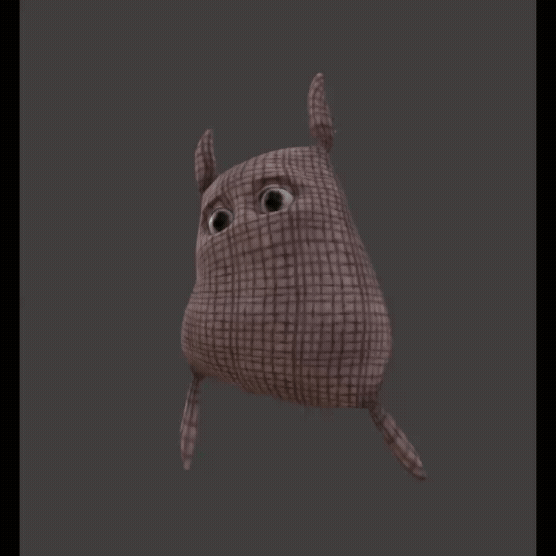
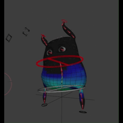
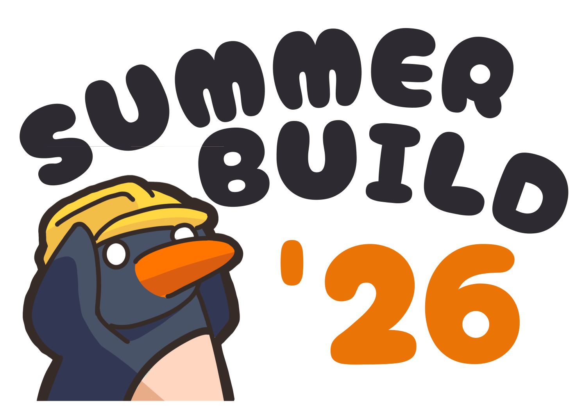

# XR Experience Team Update - May/2026

A competition team in the ilab to take part in game jams (hackathons but for games)

Video link: [https://youtu.be/lyMTNPNXN44](https://youtu.be/lyMTNPNXN44)

Note: Members will be on internship during the summer break

## Skill Development

### 3D Asset Creation

Learning 3D Asset Creation to improve workflow from Blender to Unreal Engine 5 (e.g translation of blender specific features such as bendy bones and blend shapes to morph targets)

| | | |
| :--- | :---: | :---: |
| |  | |
| |  |  |

## Hackathons/Game Jams

### Summerbuild 2026 (Upcoming)

Date: 25/5/26 ~ 18/6/26

Hackathon link: [Summerbuild 2026](https://build.ilabccds.com/)

Registered for Summerbuild 2026. Plans to build a project in Unreal Engine

Additionally hosting a Github Workshop for Summerbuild along with assisting the iLab committee with sticker production as swag for the hackathon.

### Upcoming Plans

#### GMTK 2026 Game Jam
Date: 22/7/26 ~ 26/7/26

Game jame site: [https://itch.io/jam/gmtk-jam-2026](https://itch.io/jam/gmtk-jam-2026)

Plans to go for GMTK 2026, a yearly game jame with over 9000 games submitted in 2025.

The youtube videos covering winning games consistently get around a 1 Million views

