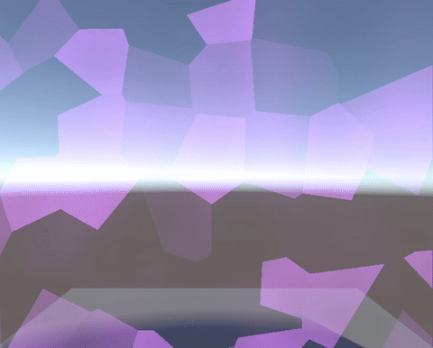
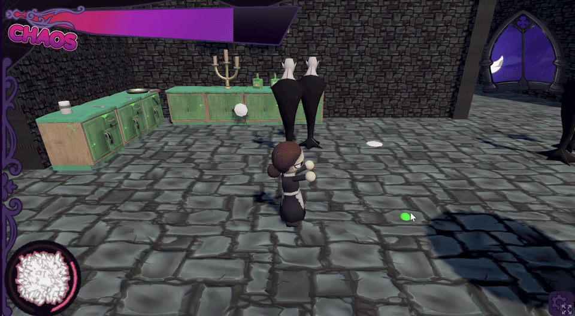
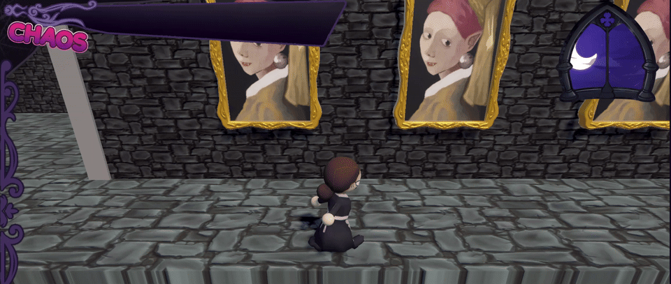
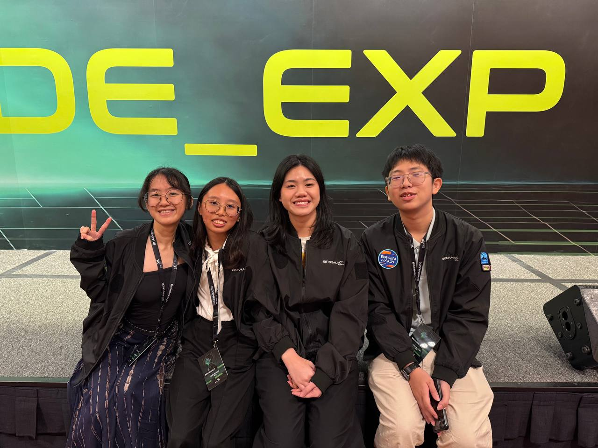
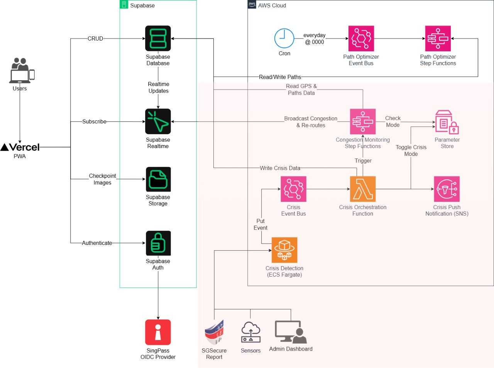

# XR Experience Team Update - May/2026

A competition team in the ilab to take part in game jams (hackathons but for games)

## Members

- **Koh Heng Woon**
- **Silviana**

## Game Jams

### GMTK 2026 Game Jam

Date: 22/7/26 ~ 26/7/26

Game jame page link: [https://itch.io/jam/gmtk-jam-2026](https://itch.io/jam/gmtk-jam-2026)

Submitted: [Down The Count](https://plasmak.itch.io/down-the-count)

Github Repo: https://github.com/ThePlasmak/gmtk-2026

Worked with a team of 8 for Global Game Jam to develop a 3D havoc wrecking game in under 48 hours

#### Skill Development

- Unity Game Engine
    - Game was developed in Unity
    - Animation Controllers setup
- 3D Assets
    - Sprites were drawn in a pixel art style
- Shader Development and Art tooling

### Brainhack - Code EXP

Hackathon link: [Brainhack 2026](https://www.dsta.gov.sg/brainhackv)

#### Skill Development

- React: frontend is written in react
- Supabase: for most of the backend (basic crud, authentication, realtime, and object storage)
- Claude code: used an AI tool to help with development
- Grok API: used to generate options during scenario play, and to grade the decisions made by the users

### Summerbuild 2026

Date: 25/5/26 ~ 18/6/26

Hackathon link: [Summerbuild 2026](https://build.ilabccds.com/)

Hosted Github Workshop for Summerbuild along with assisting the iLab committee with sticker production as swag for the hackathon.

## Misc

## Upcoming Plans

### Github Workshop

Date: 22/10/26

Organising a Github Workshop for Ilab